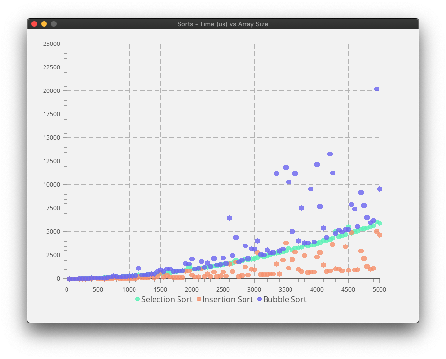

# SortWorkbench
A sorting benchmark, implemented in C/SDL

------------------

## File Tree

- `ui`
	- `SDL_util.c`
		- Bresenham line (for dotted lines)
		- Bresenham (midpoint) circle (for filled and non-filled circles)
	- `plotter.c`
		- Graph scale determining algorithm
		- Graph rendering stuffs
	- `color.c`
		- Procedural color generation 
		- HSV to RGB conversion 
- `util`
	- `ds.c`
		- ArrayList implementation
	- `intgen.c`
		- PriorityQueue implementation for storing sorted numbers
		- Inversion insertion algorithm - inserts `n` inversions into a sorted 
		  array. An inversion is when `i<j` and `A[i] > A[j]`
	- `intgentest.c`
		- Sort testing benchmark
	- `logger.c`
		- Simple logger
	- `gen.c`
		- General algorithms - min, max, swap etc.
- `sorts`
	- `sorts.c`
		- Sorts go here: selection, insertion, bubble, merge, etc etc
	- `sorttest.c`
		- The main program; compile with make PROG=sorts/sorttest.c

## Instructions for building:
- Clone the repository
- do `mkdir obj bin`
- do `mkdir obj/ui obj/sorts obj/util bin/sorts`
- do `make PROG=sorts/sorttest`. You must have LibSDL2 and LibSDL\_TTF 

The final executable is made in `bin/sorts/sorttest`. Run it and enjoy :)
